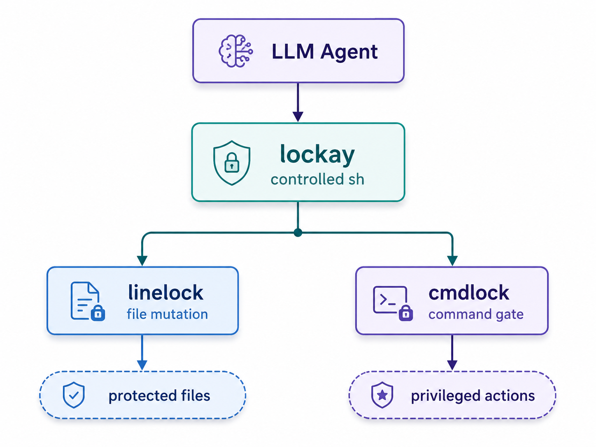

<p align="center">
  <br>
  <pre style="font-size: 12px; line-height: 1.2;">
░██           ░██████     ░██████  ░██     ░██    ░███    ░██     ░██ 
░██          ░██   ░██   ░██   ░██ ░██    ░██    ░██░██    ░██   ░██  
░██         ░██     ░██ ░██        ░██   ░██    ░██  ░██    ░██ ░██   
░██         ░██     ░██ ░██        ░███████    ░█████████    ░████    
░██         ░██     ░██ ░██        ░██   ░██   ░██    ░██     ░██     
░██          ░██   ░██   ░██   ░██ ░██    ░██  ░██    ░██     ░██     
░██████████   ░██████     ░██████  ░██     ░██ ░██    ░██     ░██     v0.1.0
                                                                      
                                                                      
                                                                         
  </pre>
  <br>
  <i>chmod for lines of code &nbsp;|&nbsp; sudo for autonomous agents</i>
  <br>
  <br>
</p>

---

<p align="center">
  <b>lockay</b> 是 agent 时代的权限层。<br>
  精确控制 agent <b>可以修改哪些代码</b>和<b>可以执行哪些命令</b>。<br>
  不依赖 FUSE。不依赖内核模块。只是一个可审计的小型 C 二进制文件。
</p>

<p align="center">
  <a href="README.md">[ English / ]</a>
</p>

---

### 功能概述

<p align="center">
  
</p>

agent 可以读文件, 不能直接写文件。agent 只能通过 lockay 提交修改，lockay 验证锁区后才写入。agent 只能通过 cmdlock 执行命令，cmdlock 检查策略后才放行。

| 层级 | 解决的问题 | 方式 |
|------|-----------|------|
| **linelock** | agent 改错代码 | 基于内容哈希的文件区域锁 |
| **cmdlock** | agent 执行危险命令 | L0-L4 风险分级 + 策略引擎 |

---

### 安装

**使用安装脚本 (推荐):**

```bash
curl -fsSL https://raw.githubusercontent.com/Steven-ZN/lockay/main/install.sh | sh
```

**或从源码编译:**

```bash
git clone https://github.com/Steven-ZN/lockay.git
cd lockay && make
sudo make install          # 系统级安装
make install-local          # 用户级安装 (~/.local/bin)
```

依赖: gcc 或 clang, GNU make, Linux/macOS/BSD/WSL。零第三方库依赖。

---

### 60 秒上手

```bash
cd /your/project

# 生成命令策略
lockay policy

# 按行号锁定一段代码
lockay lock src/api.py 40 80 steven "public contract"
# 格式: lockay lock <文件> <起始行> <结束行> [owner] [reason]

# 查看锁定状态
lockay status                  # 全部文件
lockay status src/api.py       # 单个文件

# 带锁标记查看文件 (被锁行有视觉标记)
lockay show src/api.py

# 用锁 ID 解锁 (ID 在 status 输出中显示)
lockay unlock a1b2c3

# 用 TUI 编辑器编辑
lockay edit src/model.py

# 通过策略门控执行命令
lockay run "pytest tests/"
lockay run "rm -rf build/"          # 弹出审批
lockay run "git push origin main"   # 默认拒绝
```

上锁/解锁速览:

| 操作 | 命令 | 说明 |
|------|------|------|
| 上锁 | `lockay lock <文件> <起始行> <结束行> [owner] [reason]` | 返回 6 位锁 ID |
| 查看 | `lockay status [文件]` | 列出所有锁及其 ID |
| 看内容 | `lockay show <文件>` | 被锁行有视觉标记 |
| 解锁 | `lockay unlock <锁ID>` | 用 `status` 输出的 ID 解锁 |
| 校验 | `lockay check <文件>` | 检查锁区内容是否被篡改 |
```

---

### linelock 原理

锁数据存储在 `.linelock/locks` (纯文本, 可 git 追踪):

```
src/api.py|a1b2c3|40|80|sha256:abc123...|sha256:def456...|sha256:ghi789...|steven|2026-06-07|public contract
```

每条锁记录三种 SHA-256 哈希:

| 哈希 | 内容 |
|------|------|
| **content_hash** | 被锁行内容的 SHA-256 |
| **before_hash** | 锁区前 3 行的 SHA-256 |
| **after_hash** | 锁区后 3 行的 SHA-256 |

当文件其他部分增删导致行号漂移时, lockay 通过在全文件中搜索匹配的内容哈希来自动重锚定锁区。锁保护的是**内容**, 不是**位置**。

```
编辑前:                         编辑后:
  1: import sys                  1: import sys
  2: import os                   2: import os       (新增)
  3:                             3: import re       (新增)
  4: [锁定] def api():           4:
  5: [锁定]     return 42        5: [锁定] def api():    <-- 自动重锚定
  6: [锁定]                     6: [锁定]     return 42
                                 7: [锁定]
```

---

### cmdlock 原理

命令在执行时被分为 5 个风险等级:

```
   L0  安全 ...... ls, cat, grep, echo, find, wc, diff
   L1  执行 ...... python, make, gcc, node, pytest
   L2  写入 ...... touch, mkdir, cp, mv, git add
   L3  危险 ...... rm, pip install, curl, git commit
   L4  发布 ...... git push, ssh, sudo, chmod, kill
```

策略规则 (`.lockay/policy`):

```
ls *              allow      # L0: 始终允许
pytest *          allow      # L1: 始终允许
pip install *     ask        # L3: 询问用户
rm -rf *          ask        # L3: 询问用户
git push *        deny       # L4: 始终拒绝
ssh *             deny       # L4: 始终拒绝
sudo *            deny       # L4: 始终拒绝
```

当命令命中 `ask` 规则时, lockay 弹出交互式审批:

```
--- lockay: command gate ---
Command : rm -rf ./checkpoints
Risk    : L3 (DESTRUCT)
Policy  : ASK
-----------------------------
此命令需要审批。
选项: [A] 允许一次  [D] 拒绝
```

所有决策被记录到 `.lockay/audit.log`。

---

### Agent 接口

为 LLM tool-calling 设计, 结构化退出码:

```bash
lockay show   src/main.c 100 180           # 带锁标注查看
lockay set    src/main.c 150 "new text"    # 修改一行
lockay insert src/main.c 100 "new line"    # 在某行前插入
lockay delete src/main.c 100 105           # 删除行范围
lockay apply  src/main.c /tmp/patch.diff   # 应用 unified diff
lockay run    "pytest tests/"              # 通过策略门执行
```

| 退出码 | 含义 |
|--------|------|
| 0 | 成功 |
| 1 | 拒绝 (编辑越界或策略拦截) |
| 2 | 错误 (文件不存在等) |

---

### 安全模型

```
  .---------------.         .---------------.
  |   agent 用户    |         |  codeguard     |
  |   (只读)       |         |  (拥有文件)     |
  '-------^-------'         '-------^-------'
          |                          |
          |   agent 调用              |   lockay 验证
          |   lockay CLI              |   后执行写入
          |                          |
  .-------'--------------------------'-------.
  |              lockay binary                |
  |                                           |
  |   读文件 -> 验证锁区 -> 原子写入            |
  |   (临时文件 + fsync + rename)              |
  |                                           |
  |   可信核心决不调用:                          |
  |     system() popen() exec() shell()        |
  '-------------------------------------------'
```

生产环境: `chown codeguard:codeguard repo/` + `chmod 755 repo/`。agent 以不同用户运行, 只有读权限, 所有写入经 lockay。

本地开发: lockay 在应用层执行策略, 不需要权限分离。

---

### 项目结构

```
lockay/
  src/
    main.c          CLI 分发 (14 个子命令)
    tui.c           nano 风格终端编辑器
    filebuf.c       行缓冲区 + 字符级编辑
    lockdb.c        锁元数据存储
    validate.c      内容哈希验证 + 重锚定
    apply.c         安全写入路径 (原子写入)
    cmdlock.c       命令门控 (策略引擎 + 审计)
    sha256.c        内嵌 SHA-256 (公共领域)
  tests/
    test_runner.c   51 个测试用例
  install.sh        交互式安装脚本 (中/英)
  Makefile
```

---

<p align="center">
  <b>lockay</b> &mdash; <br>
  <br>
  <sub>MIT License &nbsp;|&nbsp; <a href="https://github.com/Steven-ZN/lockay">github.com/Steven-ZN/lockay</a></sub>
</p>
